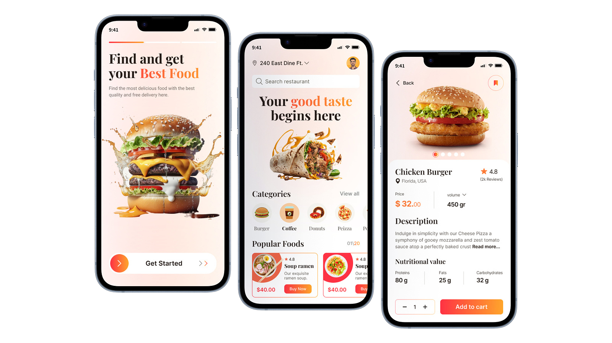

# 🍔 Hungrr - Food Delivery Platform

<div align="center">
  
  
  [](https://reactjs.org/)
  [](https://www.typescriptlang.org/)
  [](https://nodejs.org/)
  [](https://expressjs.com/)
  [](https://www.mongodb.com/)
  [](https://tailwindcss.com/)

  **A modern, full-stack food delivery platform that connects hungry customers with their favorite restaurants**
  
  [Live Demo](https://hungrr-demo.com) • [Report Bug](https://github.com/Night-Legion/Food_Delivery/issues)
</div>

## 🌟 Features

### 🛒 **Customer Experience**
- **Smart Restaurant Discovery** - Browse thousands of restaurants with advanced filtering by cuisine, price, delivery time, and ratings
- **Intelligent Search** - Find exactly what you're craving with our powerful search algorithm
- **Real-time Order Tracking** - Track your order from kitchen to doorstep with live status updates
- **Secure Payment Processing** - Safe and secure payments powered by Stripe
- **Personalized Recommendations** - Get food suggestions based on your preferences and order history
- **Mobile-First Design** - Seamless experience across all devices

### 🏪 **Restaurant Management**
- **Complete Restaurant Dashboard** - Manage your restaurant profile, menu, and orders from one place
- **Dynamic Menu Management** - Easily add, edit, and remove menu items with real-time pricing
- **Order Management System** - Process and track orders with status updates (placed → paid → in progress → out for delivery → delivered)
- **Image Upload & Management** - Showcase your restaurant and dishes with Cloudinary integration
- **Revenue Analytics** - Track your sales and performance metrics

### 🍽️ **Special Features**
- **Campus Canteen Integration** - Special module for university/college canteen ordering
- **Multi-Cuisine Support** - Support for 25+ cuisine types including Indian, Chinese, Italian, Mexican, and more
- **Smart Filtering** - Filter by vegetarian/non-vegetarian, price range, delivery time, and ratings
- **Bulk Ordering** - Perfect for office catering and large group orders
- **Schedule Orders** - Plan ahead with advanced order scheduling

## 🏗️ Tech Stack

### **Frontend**
- **React 18** with TypeScript for type-safe development
- **Vite** for lightning-fast development and building
- **Tailwind CSS** for modern, responsive styling
- **Radix UI** components for accessible UI elements
- **React Hook Form** with Zod validation for robust form handling
- **React Query** for efficient data fetching and caching
- **Auth0** for secure authentication and authorization
- **React Router** for seamless navigation

### **Backend**
- **Node.js** with **Express.js** for the REST API
- **TypeScript** for type safety across the stack
- **MongoDB** with **Mongoose** for flexible data modeling
- **Stripe** for secure payment processing
- **Cloudinary** for image upload and management
- **JWT** for secure authentication
- **Express Validator** for input validation and sanitization

### **DevOps & Tools**
- **Concurrently** for running multiple processes
- **Nodemon** for hot-reloading during development
- **ESLint** for code quality and consistency
- **Environment Variables** for secure configuration management

## 🚀 Quick Start

### Prerequisites
- Node.js (v18 or higher)
- MongoDB (local or cloud instance)
- Stripe Account
- Cloudinary Account
- Auth0 Account

### 1. Clone the Repository
```bash
git clone https://github.com/Night-Legion/Food_Delivery.git
cd Food_Delivery
```

### 2. Backend Setup
```bash
cd backend
npm install

# Create .env file
cp .env.example .env
# Configure your environment variables:
# MONGODB_CONNECTION_STRING=your_mongodb_connection_string
# CLOUDINARY_CLOUD_NAME=your_cloudinary_cloud_name
# CLOUDINARY_API_KEY=your_cloudinary_api_key
# CLOUDINARY_API_SECRET=your_cloudinary_api_secret
# STRIPE_API_KEY=your_stripe_secret_key
# STRIPE_WEBHOOK_SECRET=your_stripe_webhook_secret
# FRONTEND_URL=http://localhost:5173

# Start the development server
npm run dev
```

### 3. Frontend Setup
```bash
cd ../frontend
npm install

# Create .env file
cp .env.example .env
# Configure your environment variables:
# VITE_API_BASE_URL=http://localhost:7000
# VITE_AUTH0_DOMAIN=your_auth0_domain
# VITE_AUTH0_CLIENT_ID=your_auth0_client_id
# VITE_AUTH0_CALLBACK_URL=http://localhost:5173

# Start the development server
npm run dev
```

### 4. Stripe Webhook Setup
```bash
# In a new terminal, set up Stripe CLI webhook forwarding
stripe listen --forward-to localhost:7000/api/order/checkout/webhook
```

Your application will be running at:
- **Frontend**: http://localhost:5173
- **Backend**: http://localhost:7000

## 📱 Screenshots

<div align="center">
  
  <p><em>Modern and intuitive homepage design</em></p>
  
  
  <p><em>Smart restaurant discovery with advanced filtering</em></p>
  
  
  <p><em>Special campus canteen ordering interface</em></p>
</div>

## 🎯 API Endpoints

### **Authentication**
- `GET /api/my/user` - Get user profile
- `PUT /api/my/user` - Update user profile

### **Restaurants**
- `GET /api/restaurant/search/:city` - Search restaurants by city
- `GET /api/restaurant/:restaurantId` - Get restaurant details
- `POST /api/my/restaurant` - Create restaurant (owner)
- `PUT /api/my/restaurant` - Update restaurant (owner)
- `GET /api/my/restaurant/order` - Get restaurant orders (owner)

### **Orders**
- `GET /api/order` - Get user orders
- `POST /api/order/checkout/create-checkout-session` - Create payment session
- `POST /api/order/checkout/webhook` - Stripe webhook handler

## 🛠️ Development

### **Code Structure**
```
hungrr/
├── backend/
│   ├── src/
│   │   ├── controllers/     # Business logic
│   │   ├── models/         # Database schemas
│   │   ├── routes/         # API route definitions
│   │   ├── middleware/     # Authentication & validation
│   │   └── index.ts        # App entry point
│   └── package.json
└── frontend/
    ├── src/
    │   ├── api/            # API service layer
    │   ├── components/     # Reusable UI components
    │   ├── pages/          # Application pages
    │   ├── forms/          # Form components
    │   ├── auth/           # Authentication logic
    │   └── types.ts        # TypeScript type definitions
    └── package.json
```

### **Available Scripts**

**Backend:**
- `npm run dev` - Start development server with hot reload
- `npm run build` - Build for production
- `npm start` - Start production server
- `npm run stripe` - Start Stripe webhook listener

**Frontend:**
- `npm run dev` - Start development server
- `npm run build` - Build for production
- `npm run preview` - Preview production build
- `npm run lint` - Run ESLint

## 🌐 Deployment

### **Frontend (Vercel/Netlify)**
```bash
npm run build
# Deploy the dist/ folder
```

### **Backend (Railway/Heroku)**
```bash
npm run build
# Deploy with your preferred platform
```

### **Environment Variables**
Make sure to set all required environment variables in your production environment.

## 🤝 Contributing

We welcome contributions from the community! Here's how you can help:

1. **Fork the repository**
2. **Create a feature branch** (`git checkout -b feature/amazing-feature`)
3. **Commit your changes** (`git commit -m 'Add some amazing feature'`)
4. **Push to the branch** (`git push origin feature/amazing-feature`)
5. **Open a Pull Request**

### **Contribution Guidelines**
- Follow the existing code style and conventions
- Write clear, concise commit messages
- Add tests for new features
- Update documentation as needed


## 🙏 Acknowledgments

- **Stripe** for secure payment processing
- **Cloudinary** for image management
- **Auth0** for authentication services
- **MongoDB Atlas** for cloud database hosting
- **Vercel** for frontend hosting
- **Render** for backend hosting

## 📞 Support

If you encounter any issues or have questions:

- 🐛 Issues: [GitHub Issues](https://github.com/Night-Legion/Food_Delivery/issues)
- 💬 Discussions: [GitHub Discussions](https://github.com/Night-Legion/Food_Delivery/discussions)

---

<div align="center">
  <p>Made with ❤️ by the Hungrr Team</p>
  <p>Delivering happiness, one meal at a time! 🍽️</p>
</div>
